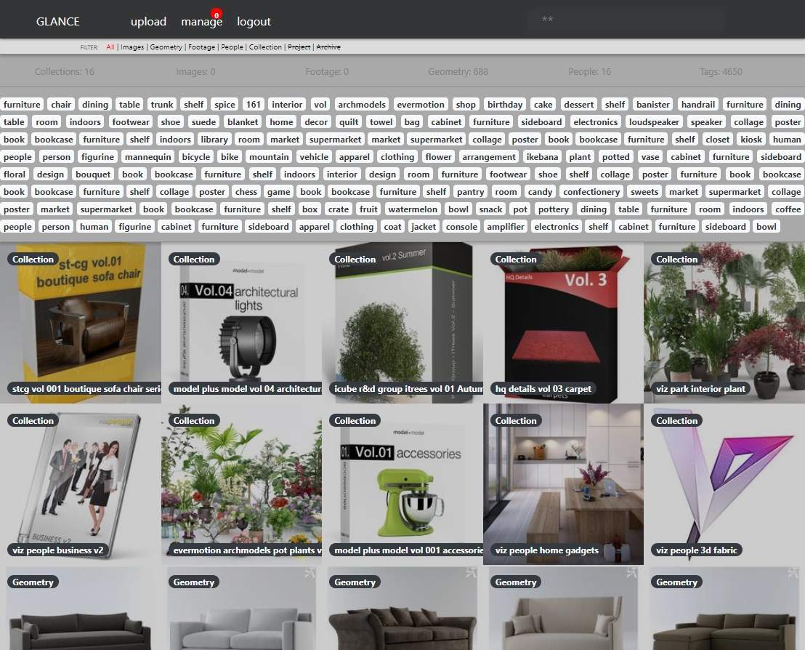

IN DEVELOPMENT

Glance
=====================

Glance is a management system for digital items. Using images to represent various forms of data. Video files, images, documents, source code etc.

Quick Start
------------

3rd Party Requirements
**********************

Postgresql

Celery

AWS account

Setup
*****

Use miniconda for env, environment.yml

.. code-block::

    $ cd dev-glance-api
    $ conda env create
    $ source activate glance-api-env

    (env)$ setup.py install

Api config
..........

User glance_api/config/EXAMPLE_config.ini as a template to build glance_api/config/config.ini

Run glance_api/api.py to get api running.

.. code-block::

    (env)$ cd glance_api
    (env)$ python api.py

App config
..........

Use glance/config/EXAMPLE_config.ini as a template to build glance/config/config.ini

.. code-block::

    (glance-api-env)$ cd glance
    (glance-api-env)$ python app.py

http://localhost:5000

Documentation
------------------------------

`Sphinx docs <./docs/_build/html/index.html>`_

Tests
-------------

Running tests, while in project root.

.. code-block:: python

    >>> python setup.py test
